## EDA (exploratory data analysis)
We will work on a database consisting of thousands of images of fresh and rotten fruits. The goal will be to build a model that is able to classify the apples into fresh or rotten.

This work could be expanded to include the other fruits, but for time and performance reasons, we will work only with apples.

First, we will import the needed libraries and we will define a function to load all images from a directory. This function will return two different shaped arrays:
- **default_x**: The formatted array to be used with models built with sklearn. It has been reshaped to have as many columns as pixels as the original image has. Also, the image has been transformed from RGB to grayscale to speed up the training.
- **keras_x**: The raw image array returned by the cv2 library. This will be used later on.


```python
import os
import numpy as np
import pandas as pd
import cv2
import matplotlib.pyplot as plt
import seaborn as sns
from sklearn.ensemble import RandomForestClassifier
from sklearn.neighbors import KNeighborsClassifier
from sklearn import svm, datasets
from sklearn.model_selection import train_test_split, cross_val_score
from sklearn.metrics import confusion_matrix, f1_score
from sklearn.metrics import accuracy_score,  precision_score, recall_score, roc_curve,roc_auc_score, auc
from sklearn.metrics import confusion_matrix, plot_confusion_matrix, precision_recall_curve
from sklearn.preprocessing import StandardScaler

def load_dataset(path):
    dataset = pd.read_csv(path, header=0, delimiter=',')
    return dataset

def load_images(path):
    X = []
    
    for img_path in os.listdir(path):
        img = cv2.imread(os.path.join(path,img_path))
        X.append(img)
    
    img_array = np.array(X)
    ## Transform to grayscale by calculating the mean of the RGB channels
    ## and reshape to have as columns as pixels the image has.
    default_x = np.reshape(np.mean(img_array, axis=3), (img_array.shape[0], img_array.shape[1] * img_array.shape[2]))
    keras_x = img_array
    return default_x, keras_x
```

The first directory to load will be train/freshapples.


```python
fresh_apples, fresh_train_keras = load_images('train/freshapples')
fresh_apples.shape
```


    (1693, 1600)


The image dataset has been expanded by the original author with transformations of the images to present the models with all possible situations that can occur in real cases.

We can visualize the first to see what the first image looks like. We can appreciate that it's a rotated version of another image.


```python
plt.rcParams["figure.figsize"] = [4, 3]
plt.imshow(cv2.cvtColor(fresh_train_keras[0], cv2.COLOR_BGR2RGB))
```


    <matplotlib.image.AxesImage at 0x1cc823c1248>


    
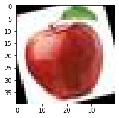
    


The next step will be to append a label column. The **value 0** will correspond to the **fresh** apples, the **value 1** to the **rotten** ones.


```python
label = np.zeros((fresh_apples.shape[0], fresh_apples.shape[1] + 1))
label[:, :-1] = fresh_apples
fresh_apples = label
fresh_apples.shape
```


    (1693, 1601)


The same goes for the rotten apples.


```python
rotten_apples, rotten_train_keras = load_images('train/rottenapples')
label = np.ones((rotten_apples.shape[0], rotten_apples.shape[1] + 1))
label[:, :-1] = rotten_apples
rotten_apples = label
rotten_apples.shape
```


    (2342, 1601)


Now we can stack them all and shuffle them, and we will get the training set.


```python
data_train = np.vstack((fresh_apples, rotten_apples))
np.random.seed(42)
np.random.shuffle(data_train)

x_train = data_train[:, :-1]
y_train = data_train[:, -1].astype(int)

x_train.shape
```


    (4035, 1600)


We repeat the whole process for the test folder to obtain the test set.


```python
fresh_apples, fresh_test_keras = load_images('test/freshapples')
label = np.zeros((fresh_apples.shape[0], fresh_apples.shape[1] + 1))
label[:, :-1] = fresh_apples
fresh_apples = label

rotten_apples, rotten_test_keras = load_images('test/rottenapples')
label = np.ones((rotten_apples.shape[0], rotten_apples.shape[1] + 1))
label[:, :-1] = rotten_apples
rotten_apples = label

data_test = np.vstack((fresh_apples, rotten_apples))
np.random.shuffle(data_test)

x_test = data_test[:, :-1]
y_test = data_test[:, -1].astype(int)

data_test.shape
```


    (996, 1601)


Finally, we will see if the data is balanced or not. 

We can see that there is a slightly higher number of rotten than fresh apples. It should not cause much trouble, though.


```python
labels, counts = np.unique(y_train, return_counts=True)

plt.figure()
plt.bar(range(len(counts)), counts, color = ['green', 'red'], alpha = .7)
plt.xticks(range(len(counts)), ['fresh', 'rotten'], rotation = 30)
plt.title('Count of each label in our training data')
plt.show()
```


    
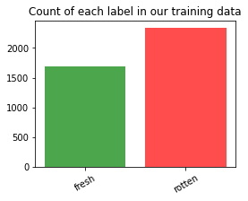
    


As we built the data array ourselves by loading the images, we are sure that there won't be any NaN values.

## Preprocessing
We have made the following transformations:
1. Scale transformation to get images of 40x40.
2. Color transformation to work on grayscale (except for the CNN model as keras is optimized to use the GPU and won't be any performance problem), as mentioned before.

The original dataset had images of different sizes and too large to be processed in a reasonable computational time. For this reason, previous to this notebook, the images have been compressed to a resolution of 40x40 using PIL.


```python
## Compression script run before creating this notebook

def resize_images(path):
    for file in dirs:
        if os.path.isfile(path+file):
            im = Image.open(path+file)
            im = im.convert('RGB')
            f, e = os.path.splitext(path+file)
            imResize = im.resize((40,40), Image.ANTIALIAS)
            imResize.save(f + '_resized.jpg', 'JPEG', quality=70)
```

There's only one important transformation to apply yet:

3. Data standardization.


```python
scaler = StandardScaler()

scaler.fit(x_train)
x_train = scaler.transform(x_train)

scaler.fit(x_test)
x_test = scaler.transform(x_test)
```

## Model selection
The models that we think will give the best results and that we will explore are the following ones:

- KNN
- Support Vector Machine
- Random Forest
- Convolutional Neural Network

We will begin by studying the first three. We will tune some of their hyperparameters and we will compare them all. We will use cross-validation with a k=3 throughout the process.


```python
models_knn = [
    (f'KNN k={k}', KNeighborsClassifier(n_neighbors=k)) 
           for k in range(3, 13, 1)
]
models_svc = [
    (f'SVC kernel={k}', svm.SVC(kernel=k, probability=True, random_state=42)) 
           for k in ('linear', 'poly', 'rbf', 'sigmoid')
]
models_rfc = [
    (f'RFC n_estimators={T}', RandomForestClassifier(n_estimators=T, max_features=0.1, random_state=42))
           for T in range(50, 201, 25)
]
```

#### Data split
Before going for the the tuning and comparisons, we will split the training data into training and validation data.

Train (80%), Validation (20%)


```python
x_train, x_val, y_train, y_val = train_test_split(x_train, y_train, train_size=0.8, random_state=42)
```

## Metrics analysis
We will consider two metrics:

*   Accuracy.
*   ROC Curves.

#### Accuracy
The first metric we will compare is the accuracy. So we will plot the accuracy for all the different models. 


```python
plt.rcParams["figure.figsize"] = [16, 9]

def plot_accuracy(models_list):
    labels = []
    k_scores = []
    stds = []

    ## use iteration to calculator different k in models, then return the average accuracy based on the cross validation
    for name, model in models_list:
        scores = cross_val_score(model, x_train, y_train, cv=3, scoring='accuracy')
        labels.append(name)
        k_scores.append(scores.mean())
        stds.append(scores.std())

    ## plot to see clearly
    plt.plot(labels, k_scores, label='score')
    plt.xlabel('Value of K for KNN')
    plt.ylabel('Cross-Validated Accuracy')
    plt.legend()
    plt.show()
    
    plt.plot(labels, stds, label='std')
    plt.xlabel('Value of K for KNN')
    plt.ylabel('Cross-Validated Std')
    plt.legend()
    plt.show()
```

###### KNN
For the KNN algorithm, the best k based on the accuracy is k=3 as it has the second highest accuracy (>0.775) and the lowest standard deviation.


```python
plot_accuracy(models_knn)
```


    
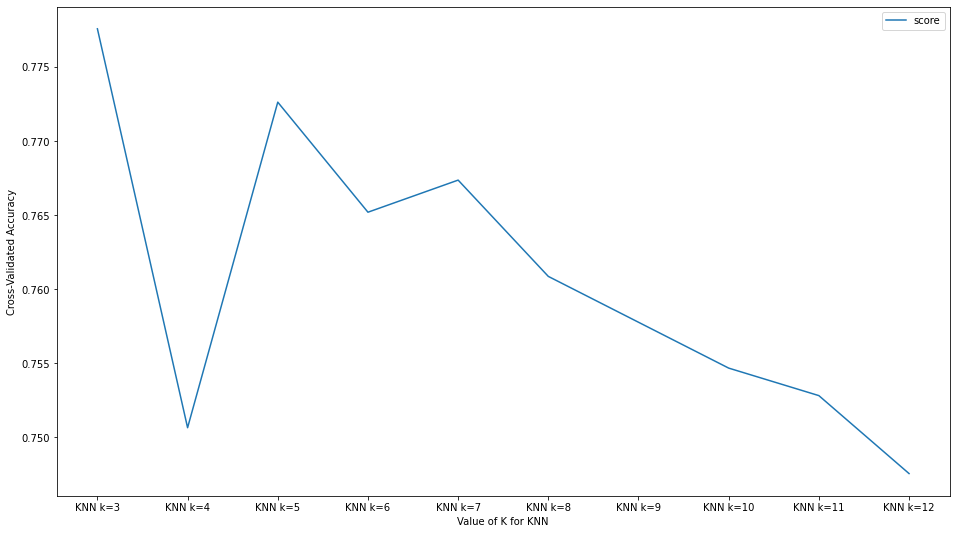
    


    
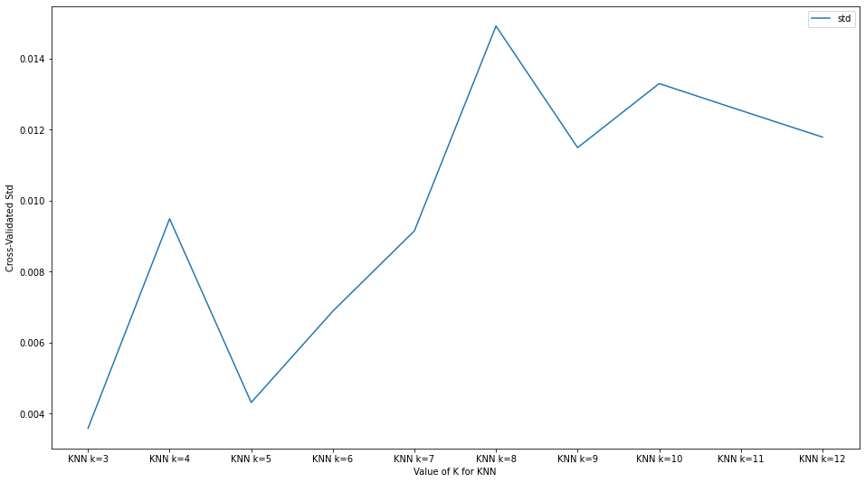
    


###### SVC
The best kernel for the SVC clearly is RBF with an accuracy of 0.8 and the lowest standard deviation.


```python
plot_accuracy(models_svc)
```


    
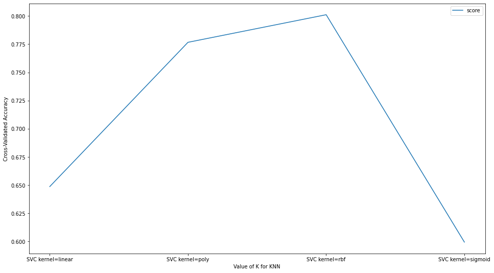
    


    
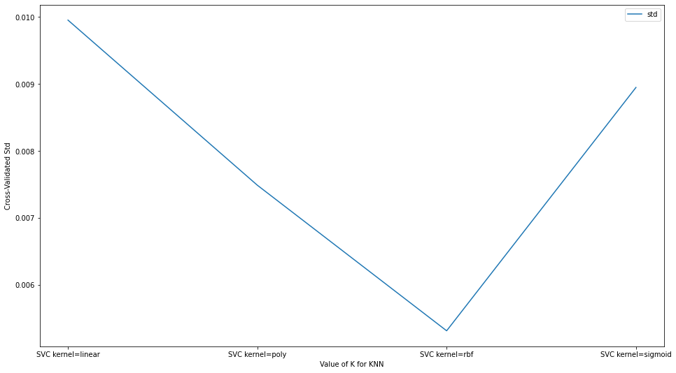
    


###### Random Forest
The accuracy for the Random Forest stabilizes around the 125 estimators, which is the best value having, the highest accuracy of the 3 compared algorithms and the lowest standard deviation for this model. 


```python
plot_accuracy(models_rfc)
```


    
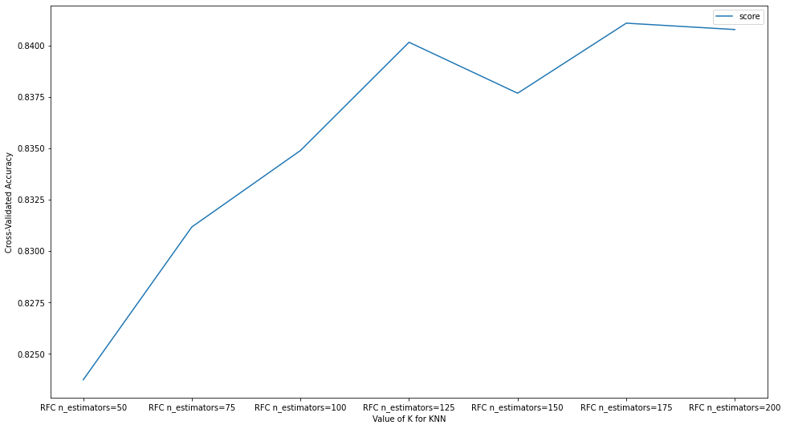
    


    
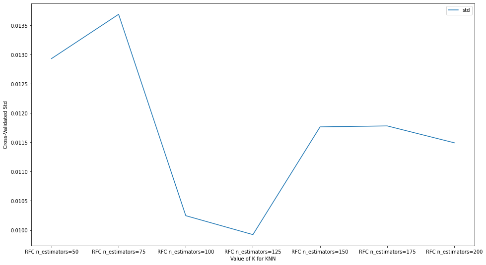
    


#### ROC Curves
Another metric that we will plot and compare is the ROC curve of each model.


```python
def plot_roc_curves(models_list):
    for name, model in models_list:
        model.fit(x_train, y_train)
        ## predict probabilities
        lr_probs = model.predict_proba(x_val)
        ## keep probabilities for the positive outcome only
        lr_probs = lr_probs[:, 1]
        lr_auc = roc_auc_score(y_val, lr_probs)
        ## summarize scores
        print('%2s: ROC AUC=%.3f' % (name, lr_auc))
        ## calculate roc curves
        lr_fpr, lr_tpr, _ = roc_curve(y_val, lr_probs)
        ## plot the roc curve for the model
        plt.plot(lr_fpr, lr_tpr, marker='.', label=name)

    ## axis labels
    plt.xlabel('False Positive Rate')
    plt.ylabel('True Positive Rate')
    ## show the legend
    plt.legend()
    ## show the plot
    plt.show()
```

###### KNN
The values for the ROC AUC of the KNN are similar, being k=3 and k=5 the highest scored values. If we had to choose the KNN as the final model, we would set the k equal to 3.


```python
plot_roc_curves(models_knn)
```

    KNN k=3: ROC AUC=0.879
    KNN k=4: ROC AUC=0.886
    KNN k=5: ROC AUC=0.880
    KNN k=6: ROC AUC=0.876
    KNN k=7: ROC AUC=0.868
    KNN k=8: ROC AUC=0.861
    KNN k=9: ROC AUC=0.853
    KNN k=10: ROC AUC=0.851
    KNN k=11: ROC AUC=0.846
    KNN k=12: ROC AUC=0.847
    


    
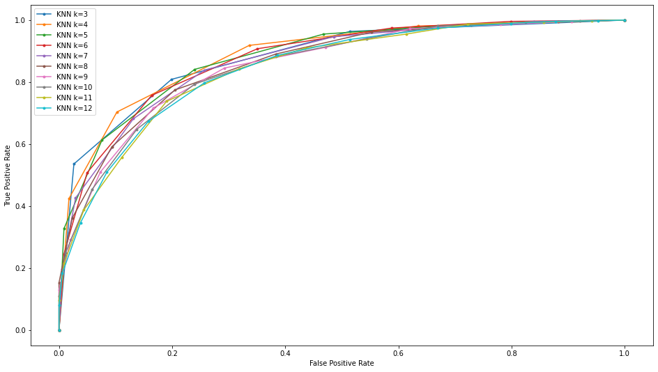
    


###### SVC
The ROC AUC for the SVC is very coherent with the accuracy score and the RBG achieves the highest score. If we had to choose the SVC as the final model, we would use the RBF kernel.


```python
plot_roc_curves(models_svc)
```

    SVC kernel=linear: ROC AUC=0.712
    SVC kernel=poly: ROC AUC=0.895
    SVC kernel=rbf: ROC AUC=0.914
    SVC kernel=sigmoid: ROC AUC=0.604
    


    

    


###### Random Forest
With the Random Forest we also get similar ROC AUC values. As they are all high (in fact, this algorithm achieves the highest scores), we would keep on 125 estimators if we had to choose the Random Forest.


```python
plot_roc_curves(models_rfc)
```

    RFC n_estimators=50: ROC AUC=0.943
    RFC n_estimators=75: ROC AUC=0.946
    RFC n_estimators=100: ROC AUC=0.948
    RFC n_estimators=125: ROC AUC=0.949
    RFC n_estimators=150: ROC AUC=0.950
    RFC n_estimators=175: ROC AUC=0.949
    RFC n_estimators=200: ROC AUC=0.950
    


    
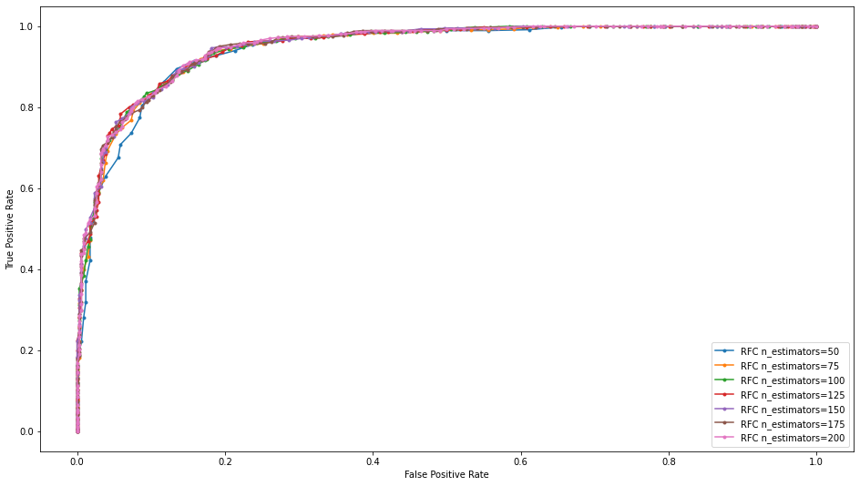
    


After analyzing these models, we can determine the Random Forest as the winner as it has the best scores both in accuracy (0.84) and ROC AUC (0.949).

The hyperparameters set are the following:
- n_estimators=125 
- max_features=0.1

#### Extra model
Though the Random Forest scored pretty decently, we will test out a final model and compare it with the winner.

###### Convolutional Neural Network
The Convolutional Neural Networks are Neural Networks that have Convolution layers, in addition to the common hidden layers, that are able to apply filters to the image and, subsequently, recognize patterns.

Recently, they've become hugely popular within the computer vision field due to their performance and possibilities. For this reason, it will be interesting to test them out and compare them against a more classical algorithm such as the Random Forest, which obtained a decent accuracy score.

Now, we will use the raw array of images returned by cv2 and will stack them up.


```python
import keras
from keras.models import Sequential
from keras.layers import Dense, Conv2D, Flatten, Input, Dropout

x_keras_train = np.vstack((fresh_train_keras, rotten_train_keras))
y_keras_train = np.hstack((np.zeros(fresh_train_keras.shape[0]), np.ones(rotten_train_keras.shape[0])))

random_index = np.arange(x_keras_train.shape[0])
np.random.shuffle(random_index)
x_keras_train = x_keras_train[random_index]
y_keras_train = y_keras_train[random_index]


x_keras_test = np.vstack((fresh_test_keras, rotten_test_keras))
y_keras_test = np.hstack((np.zeros(fresh_test_keras.shape[0]), np.ones(rotten_test_keras.shape[0])))

random_index = np.arange(x_keras_test.shape[0])
np.random.shuffle(random_index)
x_keras_test = x_keras_test[random_index]
y_keras_test = y_keras_test[random_index]


inputs = Input((40,40,3))
```

Then we split the train set into train and validation sets.


```python
x_keras_train, x_keras_val, y_keras_train, y_keras_val = train_test_split(x_keras_train, y_keras_train, train_size=0.8, random_state=42)
```

The CNN model we will build will be based out on a VGG16 architecture, proven to give great results when the dataset is not immensely large.


After a review of the state-of-the-art, we have seen that appending 2 more layers of hidden nodes gives great results. So we will add 2 hidden layers of 512 nodes after the pre-trained vgg16, which are the layers that we are really going to train. Also, we are adding a dropout layer that will change some outputs from the last layers in order to prevent overfitting.

We are going to use the sigmoid activation function both in vgg16 and in the output layers as it gives better results when it comes to binary classification. For the appended hidden layers the relu one will suffice.


```python
## Instantiate a BGG16 model
vgg16 = keras.applications.VGG16(
    include_top=False,
    weights="imagenet",
    input_shape=(40,40,3),
    classifier_activation="sigmoid",
)

## Note that we don't need to train this model as it comes pre-trained
vgg16.trainable = False

## We add some extra layers. 
X = vgg16(inputs)
X = Flatten()(X)
X = Dense(512, activation='relu')(X)
X = Dense(512, activation='relu')(X)
X = Dropout(0.5)(X)
outputs = Dense(1, activation='sigmoid')(X)

cnn_model = keras.Model(inputs, outputs)
```

Next we compile the model with an SGD optimizer and a low learning rate of 0.001.


```python
from keras.optimizers import SGD

cnn_model.compile(
    optimizer=SGD(lr=0.001),
    loss="binary_crossentropy",
    metrics=["accuracy"],
)
```

And we can train the model using the training and the validation sets. We will run 12 epochs, that will be enough.


```python
cnn_model.fit(x_keras_train, y_keras_train, validation_data=(x_keras_val, y_keras_val), epochs=1)
```

We can see that the model achieves an incredible accuracy of 0.97 in the validation test, taking the lead when compared to the models previously analyzed. It should be said that VGG16 is a powerful tool per se and that we have only expanded it to fit this problem.

###### ROC Curve
We will look at the ROC Curve too and calculate the best threshold for the model.


```python
## predict probabilities
lr_probs = cnn_model.predict(x_keras_val)
print(lr_probs.shape)
## keep probabilities for the positive outcome only
lr_probs = lr_probs
lr_auc = roc_auc_score(y_keras_val, lr_probs)
## summarize scores
print('%2s: ROC AUC=%.3f' % ('CNN', lr_auc))
## calculate roc curves
lr_fpr, lr_tpr, thresholds = roc_curve(y_keras_val, lr_probs)
## plot the roc curve for the model
plt.plot(lr_fpr, lr_tpr, marker='.', label='CNN')

## Youden index to get the best threshold
J = lr_tpr - (1 - lr_fpr)
best_index = (np.abs(J)).argmin()
best_cnn_threshold = thresholds[best_index]
print(f'CNN: Best threshold={best_cnn_threshold}')

## axis labels
plt.xlabel('False Positive Rate')
plt.ylabel('True Positive Rate')
## show the legend
plt.legend()
## show the plot
plt.show()
```

    (807, 1)
    CNN: ROC AUC=0.997
    CNN: Best threshold=0.4987521767616272
    


    
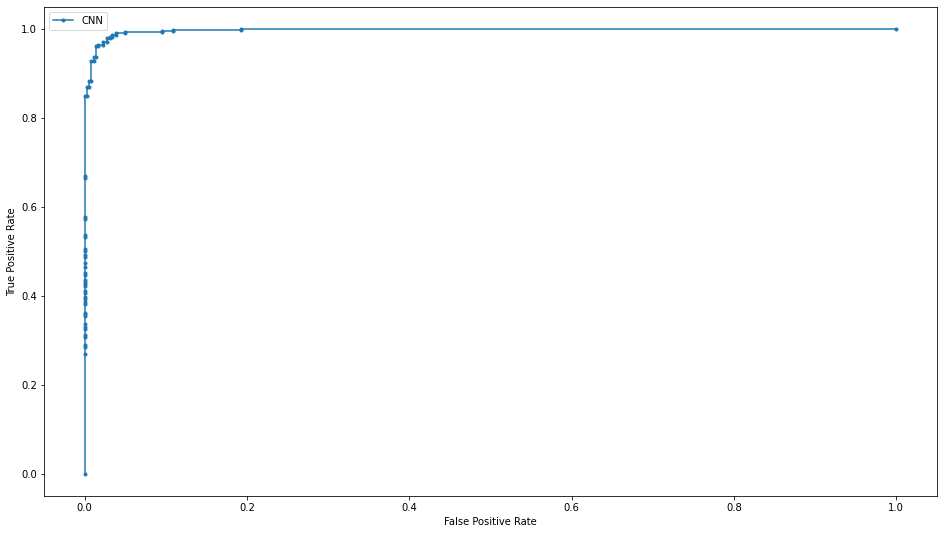
    


The model achieves a ROC AUC of 0.997, the highest of all the models analyzed the same way as with the accuracy.

We used the Youden Index to calculate the threshold that we will use to print the metrics of the final model.

#### Final model
Finally, we will show the accuracy, the precision, the recall and the f1-score of this last model using the test data to measure its performance.


```python
def print_metrics(predictions, y_test):
    labels = ['fresh', 'rotten']
    
    ##metrics
    acc = accuracy_score(y_test, predictions)
    prec = precision_score(y_test, predictions)
    rec = recall_score(y_test, predictions)
    f1 = f1_score(y_test, predictions)
    cm = confusion_matrix(y_test, predictions, normalize='true')
    
    print(f'Accuracy:{acc}')
    print(f'Precision:{prec}')
    print(f'Recall:{rec}')
    print(f'F1-score:{f1}')
    
    ax= plt.subplot()
    sns.heatmap(cm, annot=True, linewidths=.5, cmap=plt.cm.Blues)
    ## labels, title and ticks
    ax.set_xlabel('Predicted labels')
    ax.set_ylabel('True labels');
    ax.set_title('Confusion Matrix')
    ax.xaxis.set_ticklabels(labels) 
    ax.yaxis.set_ticklabels(labels);
```


```python
predictions = np.where(cnn_model.predict(x_keras_test) > best_cnn_threshold, 1, 0)
print_metrics(predictions, y_keras_test)
```

    Accuracy:0.9759036144578314
    Precision:0.9865092748735245
    Recall:0.9733777038269551
    F1-score:0.9798994974874372
    


    
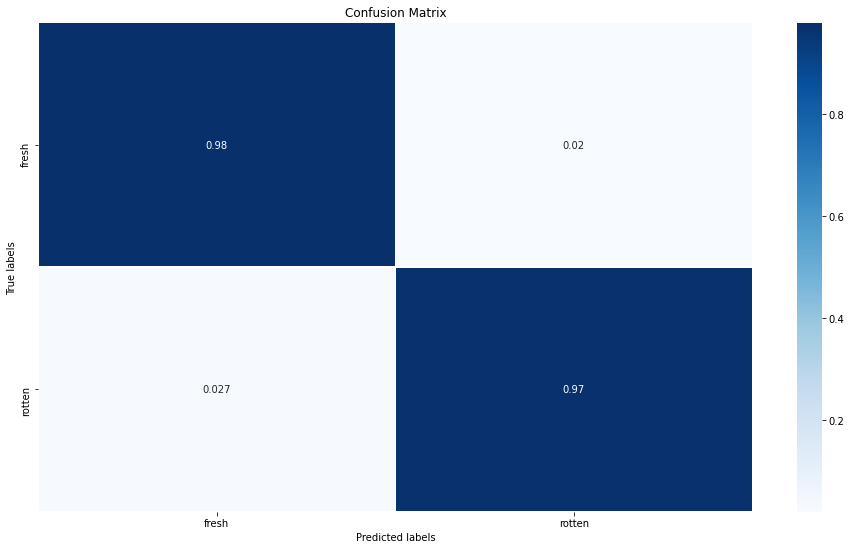
    


The final results are practically the same obtained in the training using the validation set. With an accuracy of 97.59% and a good performance thanks to using the graphics card, we can say that we built an excellent model that would be able to work with real data. We see that the slight difference between the number of fresh and rotten apples hasn't affected the training as we achieved a great f1-score.

However, we shouldn't discard the other ones if we hadn't the CNN, especially the Random Forest and the Support Vector Classifier, as both achieved an acceptable accuracy over the 80% and a good ROC AUC score. Besides, to be able to train and compare the models in a reasonable time, we had ought to work in grayscale, removing two channels of color. That surely had an impact on the performance of these models. We have also limited the number of hyperparameters to tune for this reason. It would be interesting in the subsequent work to train these same models with all the three channels and to tune the hyperparameters to get the most out of them.

As a final conclusion, this comparison shows the potential of the Convolutional Neural Networks and why it's vastly used nowadays in computer vision.
